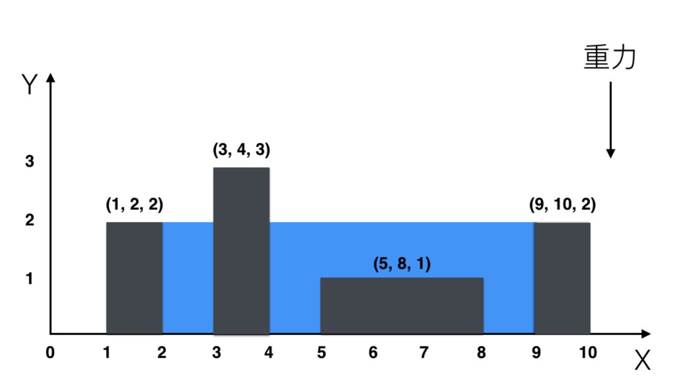

# 笔试题: 可以装多少滴水？

在一 x、y 轴平面上，给一有 n(n >= 2) 个三元组的数组 rects：

```
[(x11, x12, h1), ..., (xi1, xi2, hi), (xj1, xj2, hj), ..., (xn1, xn2, hn)]
```

对于数组中任意两个相邻三元组 (xi1, xi2, hi), (xj1, xj2, hj)，有：

```
0 < xi1 < xi2 <= xj1 < xj2;0 < hi;0 < hj;
```

每个三元组对应平面上一矩形，矩形之间的空隙可以装水，重力向下，每 1x1 面积装一滴水，求可以装多少滴水？

例子

如，输入数组为：

```
[(1, 2, 2), (3, 4, 3), (5, 8, 1), (9, 10, 2)]
```

输出：9

如图：


